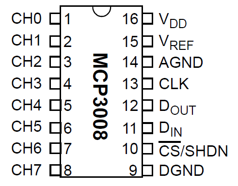

# Sensor Analog

Sensor analog merupakan sensor yang menggunakan sinyal analog untuk mentransfer datanya, berbeda dengan sensor digital, output yang dihasilkan sensor analog berupa range nilai.

## Penggunaan Sensor Analog pada Raspberry

Sayangnya raspberry tidak memiliki GPIO yang mendukung pembacaan sinyal analog, sehingga untuk menggunakan sensor analog kita perlu menggunakan alat yang bernama analog to digital converter (ADC), yang biasa digunakan adalah MCP3008

## Konversi Analog ke Digital Menggunakan MCP3008

Pada contoh kasus ini kita akan membaca sensor photoresistor (analog) ke raspberry

### 1. Mengaktifkan SPI pada Raspberry

MCP3008 menggunakan SPI (Serial Peripheral Interface) untuk mengirimkan data antara sensor analog dan raspberry, SPI merupakan sebuah interface yang biasa digunakan untuk mengirimkan data antara microcontroller dan peripheral lain seperti sensor. Untuk mengaktifkan fitur SPI pada raspberry, ikut langkah - langkah berikut :

1. Jalankan perintah `sudo raspi-config` pada terminal
2. Pilih Interfacing Options
3. Pilih SPI
4. Pilih yes
5. Reboot raspberry

### 2. Menginstall Spidev

Spidev merupakan library python yang digunakan untuk mengontrol interface SPI pada raspberry

```bash
# install python dev
sudo apt install python-dev python3-dev

# clone library SPI
git clone https://github.com/doceme/py-spidev.git

# install library SPI
cd py-spidev
make
sudo make install
```

### 3. Membuat Rangkaian

Sebelum mulai merangkai, pahami dulu struktur dari MCP3008



`CH0` hingga `CH7` merupakan tempat dimana kita meletakkan sensor analog yang ingin dikonversi menjadi digital, kemudian untuk yang di bagian kanan sambungkan dengan raspberry dengan rangkaian sebagai berikut :

| MCP3008 | Raspberry |
| ------- | --------- |
| VDD     | 3.3V      |
| VREF    | 3.3V      |
| AGND    | GROUND    |
| CLK     | SPI_CLK   |
| DOUT    | SPI_MISO  |
| DOIN    | SPI_MOSI  |
| CS      | SPI_CE0_N |
| DGND    | GROUND    |

Dengan bermodalkan informasi diatas, kita dapat membuat rangkaian seperti berikut : 


### 4. Membuat Source Code

Berikut source code untuk membaca nilai dari sensor photoresistor menggunakan MCP3008

```python
import spidev
 
#Define Channel
ldr_channel = 0
 
#Create SPI
spi = spidev.SpiDev()
spi.open(0, 0)
 
def readadc(adcnum):
    # read SPI data from the MCP3008, 8 channels in total
    if adcnum > 7 or adcnum < 0:
        return -1
    r = spi.xfer2([1, 8 + adcnum << 4, 0])
    data = ((r[1] & 3) << 8) + r[2]
    return data
 
while True:
    ldr_value = readadc(ldr_channel)
    print("LDR Value: %d" % ldr_value)
```

## Contoh Sensor Analog

Berikut beberapa contoh sensor analog yang sering digunakan :

- [Sensor Photoresistors](https://tutorials-raspberrypi.com/photoresistor-brightness-light-sensor-with-raspberry-pi/)
- [Sensor Raindrop](https://raspi.tv/2017/make-a-rain-alert-system-with-raspberry-pi)
- [Sensor Heartbeat](https://tutorials-raspberrypi.com/raspberry-pi-heartbeat-pulse-measuring/)
- [Sensor Moisture](https://tutorials-raspberrypi.com/measuring-soil-moisture-with-raspberry-pi/)
- [Sensor Gas (MQ-2)](https://tutorials-raspberrypi.com/configure-and-read-out-the-raspberry-pi-gas-sensor-mq-x/)
