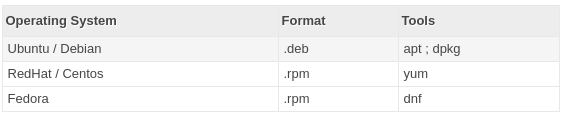

# Manajemen Paket Pada Linux

## Format Paket

Berbeda dengan windows yang menggunakan extensi `.exe`, linux memiliki banyak extensi untuk paketnya, tergantung distro yang digunakan

## Software Repository

Dalam linux, kita akan mengenal istilah **software repository**, dimana semua software yang kita butuhkan terdapat pada sebuah server, sehingga apabila kita membutuhkan aplikasi, kita cukup mencarinya di dalam repository tersebut, aplikasi yang terdapat pada server tersebut sudah diuji keamanannya dari bug dan virus, sehingga lebih aman daripada kita menginstall aplikasi bebas dari internet yang rawan terdapat virus.

**Untuk menginstall aplikasi melalui software repository, kita bisa menggunakan tool berikut :**

[`apt`](https://itsfoss.com/apt-command-guide/) - digunakan pada debian / ubuntu

[`yum`](https://www.tecmint.com/20-linux-yum-yellowdog-updater-modified-commands-for-package-mangement/) - digunakan pada redhat / centos

[`dnf`](https://www.tecmint.com/dnf-commands-for-fedora-rpm-package-management/) - digunakan pada fedora
