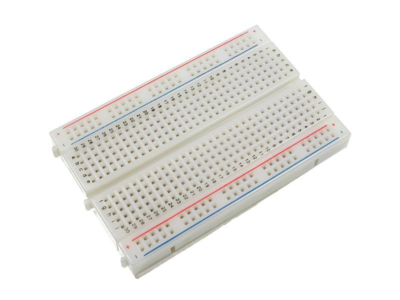
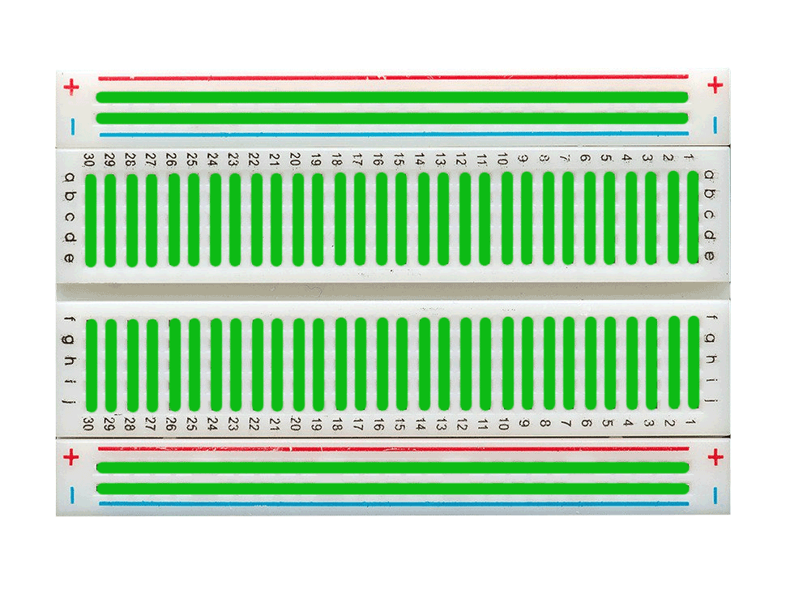

# Breadboard

## 1. Penjelasan Breadboard

Breadboard merupakan papan yang digunakan untuk menyusun rangkaian elektronik tanpa harus melakukan penyolderan, sehingga cocok digunakan untuk melakukan prototyping rangkaian

## 2. Cara Menggunakan Breadboard

