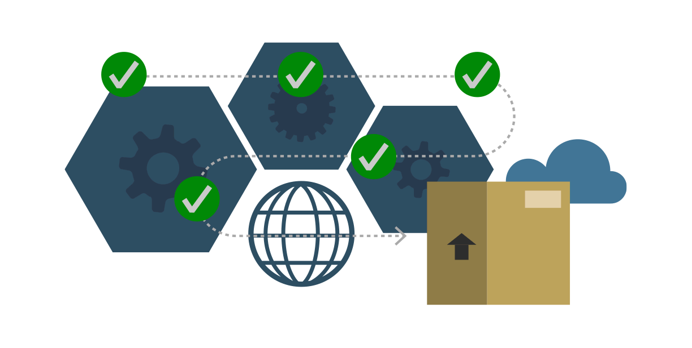

# Manajemen Paket Pada Linux 

 Sebelum mengenal linux kita harus tau apakah itu manajemen paket pada linux, manajemem paket adalah apilikasi atau sofware pada linux yang di gunakan untuk menginstall, mencari, menghapus dan mengupdate sofware. Sebelum mengenal lebih jauh tentang manajemen linux kita harus tau format paket pada distro linux. 
 

## 1. Berikut adalah format paket pada masing-masing distro : 

## 2. Untuk mengetahui tentang manajemen paket pada linux lebih jauh bisa kalian baca pada referensi link di bawah ini

-  **Tech mint -** https://www.tecmint.com/linux-package-management/
