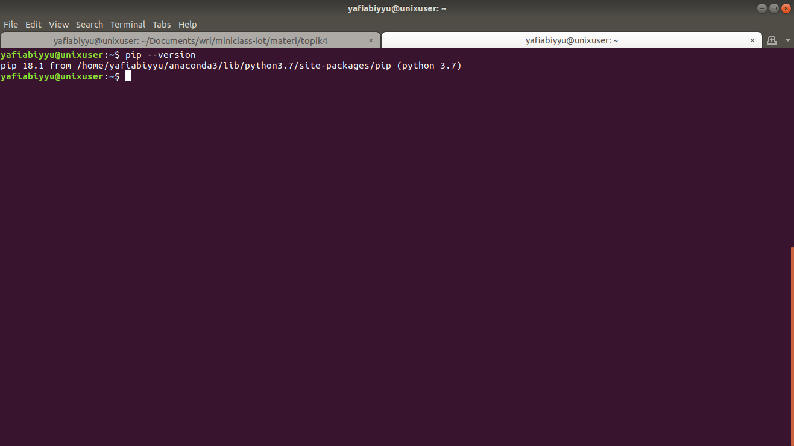
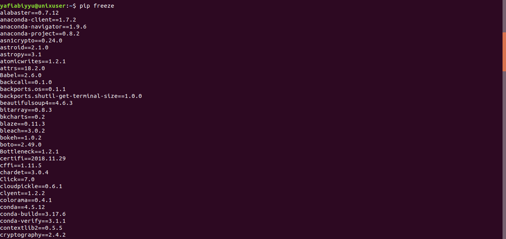

# Package Manager
PIP merupakan package management system yang digunakan untuk mengunduh dan mengelola package pada Python. Terdapat banyak seklai package yang bisa kita lihat [di sini](https://pypi.org)

## Cara menggunakan ##

1. Melihat versi pip yang terinstall

2. Melihat package yang telah terinstall

