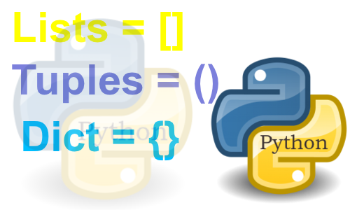

# Struktur Data Pada Python



Untuk membangun sebuah sistem, pasti kita membutuhkan pengelolaan data, karena itu memahami struktur dari data merupakan hal yang wajib.
**Python** memiliki istilah sendiri untuk menyebut struktur data yang dimilikinya, seperti `list`, `tuple`, dan `dict`

## List

Dalam python, `list` merupakan struktur data yang dapat menyimpan banyak nilai, `list` bersifat **dinamis**, artinya setelah data dimasukkan kedalam list maka data tersebut dapat dimanipulasi secara langsung atau melalui method seperti `push`, `pop`. List dibuat dengan menggunakan tanda `[]`. Dalam bahasa pemrograman lain, `list` identik dengan `array`

```python
buah = ["mangga", "anggur", "pepaya", "jeruk"]

print(buah[2]) # pepaya

buah[2] = "durian"

print(buah[2]) # durian
```

## Tuple

`tuple` mirip dengan `list`, akan tetapi `tuple` bersifat statis, artinya ketika kita pertama kali membuat sebuah tuple, kita tidak bisa lagi merubah data yang ada didalamnya, termasuk menambah atau menghapus datanya. Untuk membuat `tuple`, kita menggunakan tanda `()`

```python
buah = ("mangga", "anggur", "pepaya", "jeruk")

print(buah[2]) # pepaya

buah[2] = "durian" # error, tuple tidak bisa diubah
```

## Dictionary

`dictionary` merupakan kumpulan data yang memiliki `key` dan `value`, `key` ini harus unik sedangkan `value` boleh duplikat. `dictionary` dibuat dengan menggunakan tanda `{}`. Pada bahasa pemrograman lain `dictionary` mirip dengan `object`

```python
siswa = {
  'nama': 'budi',
  'kelas': 1,
  'jurusan': 'teknik informatika'
}

print(siswa['jurusan']) # teknik informatika

siswa['jurusan'] = 'tata boga'

print(siswa['jurusan']) # tata boga
```

## Referensi

https://medium.com/@raymonduchen/python-tuple-list-and-dictionary-c33c8754a63c
